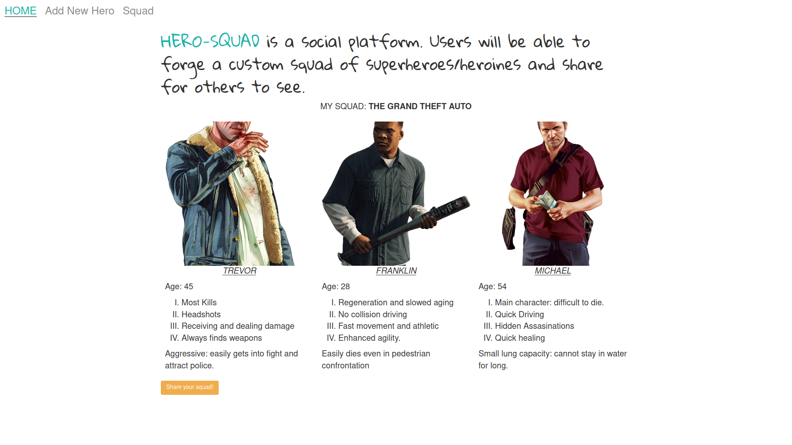

# hero-squad

## Project Description
HERO-SQUAD is a java web application. Users on the platform sorely for entertainment purpose can fabricate a team of fictional superheroes and heroines alike commited to a cause choosen by the user. Users share their creation on the platform for others to see and also to view from others.

## Installation and set-up
* Step 1 : Clone this repository using git clone https://github.com/jumaBrian/hero-squad.git, or download a ZIP file of the repository.
* Step 2 : The repository, if downloaded as a .zip file will need to be extracted to your preferred location and opened.
* Step 3 : Open the folder in a java IDE.
* Step 4 : Navigate to App.java.
* Step 5 : Executing App.java should launch the application on your computer's local host.
* Step 6 : Retrieve local host url from the IDE output window.
* Step 7 : Visit this link from your browser.

## Built with
 Spark Framework - A micro framework for creating web applications in java.
 Java - programming language.
 
## Author
Brian Juma.
 
Contact me via email: njengabrianj@gmail.com

## License 
The project is served under the MIT LICENSE copyright &copy; 2022 jumaBrian.
View <a href="https://github.com/jumaBrian/hero-squad/blob/master/LICENSE">license.</a>
